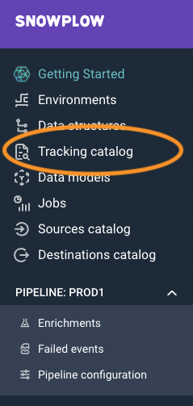
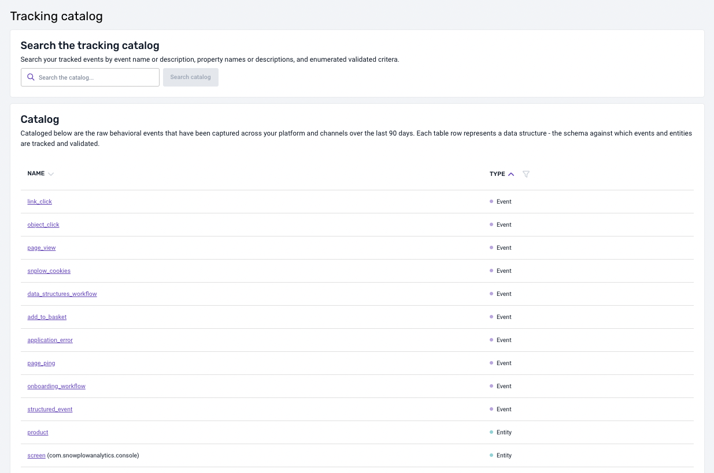
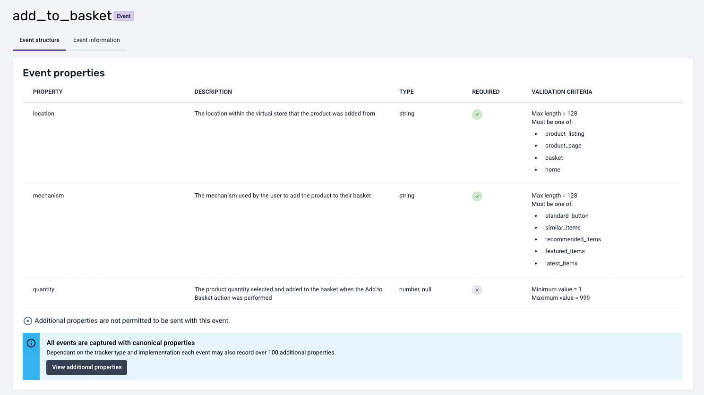
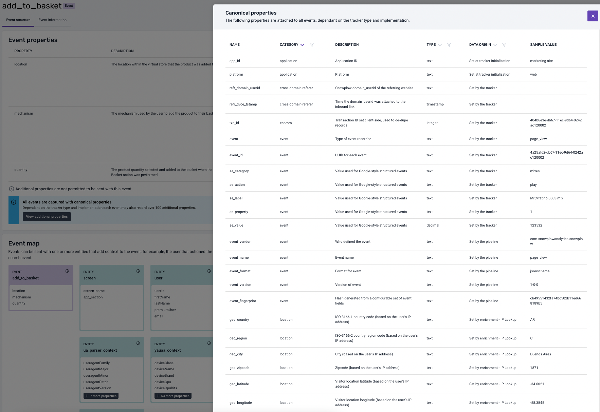
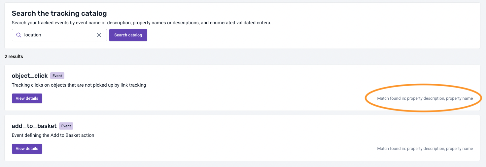

## Introducing the Tracking Catalog

Discovery and understanding of the data your organisation is tracking through Snowplow is essential to enable teams to unlock real value from that data.
We know that in many cases, Data Analysts, Data Scientists and Product Managers struggle to find out what is being tracked, and what the data means. They normally have to rely on tribal knowledge and source this information directly with the front end developers who instrumented the tracking, or raise a request to the Data Team.

However, through the Tracking Catalog, all users can have a holistic view of all their tracking in a always up-to-date and easy to consume view.

* * *

## Browsing the Tracking Catalog

**_NOTE:_** Please note that the Tracking Catalog is available only for BDP Customers on selected Tiers. If you're unsure about your eligibility, please get in touch with your Customer Success Manager.

Once logged in Snowplow Console, you will see a new link on the left hand side navigation, called Tracking Catalog. 

Once you navigate to it, you will be presented with a view showing all the Events and Entities that have been tracked your Snowplow production pipelines in the past 90 days.

If you select a particular Event, you can see the details of the Events, what properties are tracked for this event, described in plain English therefore easily consumable by a non-technical audience. You can also see any validation criteria associated with this event. The catalog will also display all canonical properties which are also tracked out of the box, when you use Snowplow trackers.

If you scroll down the page, you will see an Event map. 
This map display what entities are being tracked with this event. This information is really valuable to understand the connections between the data.
It also helps data consumers to make sense of how data is structured in the data warehouse and make it easier for them to understand how to query it.

Similarly, you can navigate to an Entity, by simply selecting one from the map or the list view, and explore details of it structure and what Events it is being tracked with.

For both Events and Entity, the Tracking Catalog also displays a log of version changes to help users understand how the data is evolving through time.

* * *

## Discovery throught the Tracking Catalog

Often, data consumers only have high level information to guide their data discovery process, and are not aware of the exact name of the Data Structure used for tracking certain data.
This is why the Tracking Catalog search function will map results of a search to various potential properties. 

When a search is carried out, the Tracking Catalog will try and find results matching the searched text in both the Data Structure name, its description, its properties's names and potential enumeration of values.
If a match is found, it will highlight the reason behind the match.

The Tracking Catalog will provide your team with easy and self serve access to this data, creating greater transparency and autonomy. 
Ultimately this can help improve the data culture in your organisation and foster a more collaborative approach to create Data Products.

